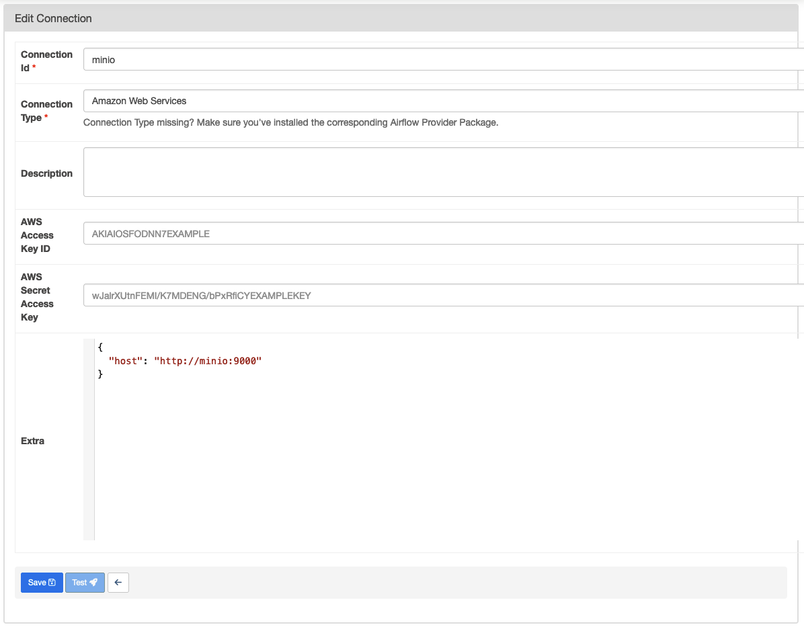

# Data Pipelines with Airflow on Local

## Contents

- Prerequisites
  - [Installing Docker Desktop](./docs/installing-docker-desktop.md)
  - [Installing Visual Studio Code](./docs/installing-vscode.md)
- [Starting Airflow](#starting-airflow)
- [Airflow S3 Connection to MinIO](#airflow-s3-connection-to-minio)


## Starting Airflow

Before we run Airflow, let's create these folders below first. Please note that if you're using Windows, you can skip this step.

```sh
mkdir -p mnt/dags mnt/logs mnt/plugins mnt/tests
```

On **Linux**, please make sure to configure the Airflow user for the docker-compose:

```sh
echo -e "AIRFLOW_UID=$(id -u)" > .env
```

With `LocalExecutor`

```sh
docker-compose build
docker-compose up -d
```

To clean up the project, press Ctrl+C then run:

```sh
docker-compose down
```
Default Username & Password for Login Airflow
- Username: airflow
- Password: airflow

## MinIO
Default Username & Password for Login MinIO
- Username: minio
- Password: minio123

## Airflow Connection to MinIO

Since MinIO offers S3 compatible object storage, we can set the connection type to "Amazon Web Services". However, we'll need to set an extra option, so that Airflow connects to MinIO instead of S3.

- Connection Name: `minio` or any name you like
- Connection Type: Amazon Web Services
- AWS Access Key ID: `<replace_here_with_your_minio_access_key>`
- AWS Secret Access Key: `<replace_here_with_your_minio_secret_key>`
- Extra: a JSON object with the following properties:
  ```json
  {
    "host": "http://minio:9000"
  }
  ```

See the example below:



**Note:** If you were using AWS S3 already, you don't need to specify the host in the extra.